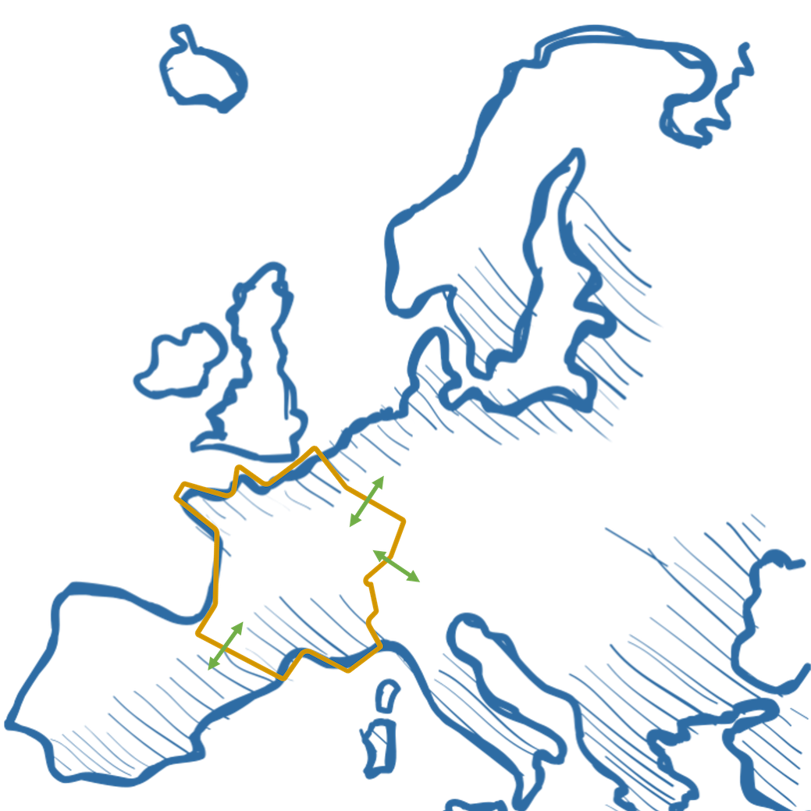

# Futurs énergétiques 2050 (Energy future 2050)


Description
-----------

This is a repository containing a scenario that implements the projections of the 
French electricity operator (RTE) for:

* electricity
* hydrogen
* other liquid and gaseous fuels

It is meant to be used in `premise` in addition to a global IAM scenario, to provide 
refined projections at the country level.

This data package contains all the files necessary for `premise` to implement
this scenario and create market-specific composition for electricity (including imports from
neighboring countries), liquid and gaseous fuels (including hydrogen).

The data relating to the annual production volumes of different energy carriers (e.g. electricity, hydrogen) 
for each Energy Futures 2050 scenario (18 in number) have been formatted and organised in a data package 
defined by the Frictionless standards (Walsh and Pollock, 2022). This data package is read and interpreted 
by premise. We therefore store a number of scenarios in a single data package. 

This is made up of four elements: 

* A datapackage.json file, which provides the metadata for the data package (e.g. authors, scenario descriptions, list and locations of resources, etc.). 
* A config.yaml file which provides the correspondence between the scenario variables and the LCA datasets in the ecoinvent DB, as well as the "LCA datasets to be created" as they are not available in the ecoinvent DB. 
* A tabular data file containing the time series for each variable in the set of scenarios. 
* An optional text file containing the LCA inventories of the "LCA datasets to be created" for any technology not initially present in the ecoinvent DB. 


Sourced from publication
------------------------

Projections are extracted from:

Futurs énergétiques 2050\
Réseau de Transport d'Electricité\
https://assets.rte-france.com/prod/public/2021-12/Futurs-Energetiques-2050-principaux-resultats.pdf

Authors of this data package
----------------------------

* Johanna Schlesinger (joanna.schlesinger@minesparis.psl.eu)
* Romain Sacchi (romain.sacchi@psi.ch)


Data validation 
---------------

[](https://goodtables.io/github/romainsacchi/RTE_scenarios)

Test 
----


Ecoinvent database compatibility
--------------------------------

ecoinvent 3.9.1 cut-off

IAM scenario compatibility
---------------------------

The following coupling is done between IAM and FE2050+ scenarios:

| IAM scenario            | FE2050+ scenario                       |
|-------------------------|----------------------------------------|
| IMAGE SSP2-Base         | Extensive reindustrialization - M0     |
| IMAGE SSP2-Base         | Extensive reindustrialization - M1     |
| IMAGE SSP2-Base         | Extensive reindustrialization - M23    |
| IMAGE SSP2-Base         | Extensive reindustrialization - N03    |
| IMAGE SSP2-Base         | Extensive reindustrialization - N1     |
| IMAGE SSP2-Base         | Extensive reindustrialization - N2     |
| IMAGE SSP2-Base         | Reference - M0                         |
| IMAGE SSP2-Base         | Reference - M1                         |
| IMAGE SSP2-Base         | Reference - M23                        |
| IMAGE SSP2-Base         | Reference - N03                        |
| IMAGE SSP2-Base         | Reference - N1                         |
| IMAGE SSP2-Base         | Reference - N2                         |
| IMAGE SSP2-Base         | Sobriety - M0                          |
| IMAGE SSP2-Base         | Sobriety - M1                          |
| IMAGE SSP2-Base         | Sobriety - M23                         |
| IMAGE SSP2-Base         | Sobriety - N03                         |
| IMAGE SSP2-Base         | Sobriety - N1                          |
| IMAGE SSP2-Base         | Sobriety - N2                          |


What does this do?
------------------



This external scenario creates markets for France listed below, according
to the projections from the RTE's Energy Future 2050 (yellow boundaries in map above).

Electricity
***********

* `market for electricity, high voltage, EF2050` (FR)
* `market for electricity, medium voltage, EF2050` (FR)
* `market for electricity, medium voltage, EF2050` (FR)

These markets are relinked to activities that consume electricity in France.

Additionally, the French market relies to a varying extent on imports from
neighboring countries. These imports are sourced from the rest of Europe, which is
provided by the regional IAM market for European electricity (blue boundaries in map above).

How are technologies mapped?
---------------------------
The tables below show how the mapping between reported technologies
and LCI datasets is done. Unless specified otherwise, ecoinvent
LCI datasets are used.

Electricity
***********

| Technologies in FE2050+             | LCI datasets used                                               | Remarks                                                                         |
|-------------------------------------|-----------------------------------------------------------------|---------------------------------------------------------------------------------|
| Hydro, run-of-river                 | electricity production, hydro, run-of-river                     |
| Hydro, alpine reservoir             | electricity production, hydro, reservoir, alpine region         |
| Nuclear, Evolutionary Power Reactor | electricity production, Evolutionary Power Reactor (EPR)        | Datasets from 10.1177/0957650912440549.                                         
| Nuclear, Small Modular Reactor      | electricity production, Small Modular Reactor (SMR)             | Based on 10.1073/pnas.2111833119.
| Nuclear, Pressure water reactor     | electricity production, nuclear, pressure water reactor         |
| Conventional, Waste-to-Energy       | treatment of municipal solid waste, incineration                |
| Conventional, Other                 | electricity production, natural gas, combined cycle power plant |                                                                                 |
| Conventional, Coal                  | electricity production, hard coal                               |
| Conventional, Natural gas           | electricity production, natural gas, combined cycle power plant |
| Conventional, Oil                   | electricity production, oil                                     |
| Renewable, Photovoltaic             | electricity production, photovoltaic                            | Datasets from 10.13140/RG.2.2.17977.19041.                                      |
| Renewable, Wind turbines, Onshore   | electricity production, wind, 1-3MW turbine, onshore            |
| Renewable, Wind turbines, Offshore  | electricity production, wind, 1-3MW turbine, offshore           |
| Renewable, Geothermal               | electricity production, deep geothermal                         | Dataset provided by premise, based on the geothermal heat dataset of ecoinvent. |
| Renewable, Biomass                  | heat and power co-generation, wood chips, 6667 kW               |
| Renewable, Biogas                   | heat and power co-generation, biogas, gas engine                |
| Renewable, Wave                     | electricity production, wave energy converter                   | Dataset from 10.1007/s11367-018-1504-2
| Storage, Hydrogen                   | electricity production, from hydrogen                           |
| Storage, Vehicle-to-grid            | electricity production, from vehicle-to-grid                    |
| Storage, Battery                    | electricity production, from stationary battery                 | Dataset from 10.1016/j.jclepro.2022.132899.
| Storage, Pumped hydro               | electricity production, hydro, pumped storage                   |

Imports and Exports
-------------------

Available data
______________

The Figure 10-4 provided by RTE provide the imports, exports and balance (“solde annuel”).
The File “Bilans énergétiques” provided by RTE provides the balance (“solde exportateur”). 
The data “solde annuel” provided by RTE in the Figure 10-4 and the data “solde exportateur” provided by RTE in the file “Bilans énergétiques”  do not match. 

Balance
_______

As the data used is taken from the file “Bilan énergétiques”, the balance used is the one provided in the file “Bilans énergétiques”. 

Imports and exports 
___________________

The ratio of imports and exports are calculated based one the data provided in Fig. 10-4. 
This ratio is applied to the balance taken from “Bilan énergétiques” to recalculate imports and exports. 

Note
____

This calculation method was suggested by RTE experts that worked on Futurs Energétiques 2050 study. 
The difference between balance data from two files (“solde annuel” and “solde exportateur”) is maximum 17%. 

Other hypotheses
•	As the ratios of imports and exports are not provided in Fig. 10-4 for 2060, the ratios of 2050 were reused for 2060. 
•	The imports and exports data provided in Fig. 10-4 are given for each scenario M0, M1, M23, N1, N2, N03) but are not given for each consumption trajectory (reference, sobriety, reindustrialization). It was assumed that the ratios of imports and exports are the same for the three trajectories (for example, same ratios for M1 reference, M1 sobriety and M1 reindustrialization). 


New inventories
_______________

Some technological variables, such as those representing wave energy and electricity 
production from nuclear power plants of the EPR or SMR type, do not have datasets in the 
ecoinvent database. We therefore had to integrate them from the scientific literature. 
For these, we chose the following sources: 

* Electricity from wave energy: Inventories modelled from a PELAMIS generator, 
producing 2.97 GWh annually over a 20-year period. Inventories taken from 
Thomson et al. (2019). 

* Electricity produced by an EPR-type nuclear power plant: Inventories modelled on 
the basis of a 1,500 MWe reactor, with an electrical efficiency of 33.8%, a 
60-year lifetime and a burn-up level of 60 MW-day/kg of fuel. The inventories are 
taken from Simons and Bauer (2012). 

* Electricity generated by a small modular nuclear reactor: Inventories modelled on 
the basis of a 160 MWe reactor, approximated from a 1GWe PWR reactor, based on 
calculations by Krall et al. (2022). The fuel burn-up rate has been adjusted from 
53 MW-day/kg fuel to 34 MW-day, resulting in a decrease in efficiency of almost 36%. 
The infrastructure data set (nuclear power plant) has been recalculated on the 
basis of a load factor of 90% and a lifetime of 60 years. The yield of low-level 
radioactive waste and spent nuclear fuel has been increased by a factor of 2.18 
and 1.72 respectively. This is an approximation that can be reasonably used as 
long as the share of this technology in the mix is not preponderant. 

* Electricity from photovoltaic (PV) panels: Although the ecoinvent database contains 
inventories representing electricity production from PV, these are not up-to-date 
and reflect efficiency levels that are too low (i.e., 12-13%) compared with PVs 
on the market today (i.e., ~18%). We therefore use more recent inventories 
(Fthenakis, Leccisi and Frischknecht, Rolf; Stolz, Philippe; Krebs, Luana; de Wild-Scholten, Mariska; Sinha, 2021),
with : an electricity production rate for each type of installation specific to France : 

  * PV on roof: 968 kWh/kW installed 
  * Facade-mounted PV: 678 kWh/kW installed 
  * Ground-mounted PV: 1.026 kWh/kW installed 
  * A breakdown of current installations representative of France:
    * Residential installations: 17% of electricity production 
    * Commercial installations: 83% of electricity production 
  * And a lifespan of 30 years. 

Finally, premise modifies the efficiency of PV panels according to their technology 
and the year of the scenario (see documentation). 

Storage
_______

We have also developed several datasets to represent different electricity 
storage options, including : 

* The supply of electricity from fuel cells operating on previously stored hydrogen. 
An electrolyser is operated with the average electricity mix to produce the hydrogen 
required by the fuel cell. The electrolyser requires 55 kWh of electricity per kg 
of hydrogen produced in 2020 - 61% efficiency - rising to 48 kWh in 2050 - 70% 
efficiency (Terlouw et al., 2022). Fuel cells require 0.06 kg of hydrogen per kWh 
of electricity produced in 2020 - 50% efficiency - to reach 65% efficiency in 2050 
(Cigolotti, Genovese and Fragiacomo, 2021). The total efficiency of this means of 
storage is therefore 30% in 2020. This will improve slightly over time, as the 
efficiency of the electrolyser and the fuel cell increases, reaching 35% by 2050. 
The fraction of fuel cell required to produce 1 kWh is :
  * 1 kWh/(80,000 hours * 2 kW) = 6.25e-6 assuming that the fuel cell operates for 
80,000 hours or 18 years and has a rated output of 2 kW.

* The supply of electricity from electric vehicle batteries. We do not consider the 
impacts linked to the manufacture of the battery, as these are associated with the 
manufacture of the vehicle. We assume a charge-discharge efficiency of 87.5%, which 
is typical for an electric vehicle (Sacchi, Bauer, et al., 2022).

* Supplying electricity from stationary batteries. An NMC-622 Li-ion battery is used 
for this purpose, with a charge-discharge efficiency of 81%. Originally based on
a dataset for a 14.4 kWh home storage system (Jasper et al., 2022)
Friedrich B. Jasper, Jana Späthe, Manuel Baumann, Jens F. Peters, Janna Ruhland, Marcel Weil,
Life cycle assessment (LCA) of a battery home storage system based on primary data,
Journal of Cleaner Production, Volume 366, 2022, https://doi.org/10.1016/j.jclepro.2022.132899.

To represent cross-border trade, we use the dataset representing the European 
electricity mix. This electricity mix, initially present in the ecoinvent database, 
is transformed by premise, and depends on the global scenario used as input. 
The Energy Futures 2050 scenarios do not detail the electricity mix of neighbouring 
countries. We therefore consider the average European mix as projected by IAM's 
global scenarios. This mix changes with the global scenario used (e.g., SSP1, SSP2, SSP5) 
as well as the climate policy considered (e.g., RCP6, RCP 2.6, RCP 1.9).

Losses
______

We then model the losses associated with the transmission of electricity from high to 
medium voltage (3.12%), and from distribution to low voltage (3.07%), on the basis of 
IEA statistics for France (International Energy Agency, 2022). It should be noted that 
the breakdown of production between run-of-river and reservoir-equipped hydroelectric 
plants is not given, and is therefore based on current statistics: 24% for run-of-river
plants, 76% for reservoir-equipped plants.

Fuels
*****

Markets for diesel, gasoline and gas are created:

* `market for diesel, EF2050` (FR)
* `market for gasoline, EF2050` (FR)
* `market for compressed gas, high pressure, FE2050` (FR)
* `market for compressed gas, low pressure, FE2050` (FR)

These markets are relinked to activities that consume liquid and gaseous fuels in France.

| Technologies in FE2050+ | LCI datasets used                                 | Remarks |
|-------------------------|---------------------------------------------------|---------|
| Fossil, diesel          | market for diesel, low-sulfur                     |   
| Fossil, gasoline        | market for gasoline, low-sulfur                   |
| Biofuel, biodiesel      | biodiesel, from rapeseed oil, at fuelling station |
| Biofuel, bioethanol     | ethanol production from sugar beet                |
| CNG                     | market for natural gas, high pressure             |
| LNG                     | market for natural gas, liquefied                 |
| Biomethane              | market for biomethane, high pressure              |         |


Hydrogen
********

Markets for hydrogen are created:

* `market for hydrogen, gaseous, for refinery use, FE2050` (FR)
* `market for hydrogen, gaseous, for ammonia use, FE2050` (FR)
* `market for hydrogen, gaseous, for chemicals use, FE2050` (FR)
* `market for hydrogen, gaseous, for steel use, FE2050` (FR)
* `market for hydrogen, gaseous, for various use, FE2050` (FR)

These markets are relinked to activities that consume hydrogen in France, 
according to their area of application.

| Technologies in FE2050+       | LCI datasets used                                                       | Remarks |
|-------------------------------|-------------------------------------------------------------------------|---------|
| Hydrogen, electrolysis        | hydrogen production, electrolysis, 25 bar, domestic                     |
| Hydrogen, from coke gas + CCS | hydrogen, recovered from coke oven gas, with carbon capture and storage |
| Hydrogen, refinery            | hydrogen production, gaseous, petroleum refinery operation              |
| Hydrogen, from chlore-alkali  | chlor-alkali electrolysis, diaphragm cell                               |
| Hydrogen, APME cracking       | hydrogen cracking, APME                                                 |
| Hydrogen, from SMR of NG      | hydrogen production, steam reforming                                    |
| Hydrogen, from ammonia        | hydrogen production, steam reforming                                    |


Flow diagram
------------


How to use it?
--------------

```python

    import brightway2 as bw
    from premise import NewDatabase
    from datapackage import Package
    
    
    fp = r"https://raw.githubusercontent.com/romainsacchi/RTE_scenarios/main/datapackage.json"
    FE2050 = Package(fp)
    
    bw.projects.set_current("your_bw_project")
    
    ndb = NewDatabase(
            scenarios = [
                {"model":"image", "pathway":"SSP2-Base", "year":2050,},
                {"model":"image", "pathway":"SSP2-RCP26", "year":2030,},
            ],        
            source_db="ecoinvent 3.8 cutoff",
            source_version="3.8",
            key='xxxxxxxxxxxxxxxxxxxxxxxxxxxxxxxxxxx',
            external_scenarios=[
                FE2050, # <-- list datapackages here
            ] 
        )
```

